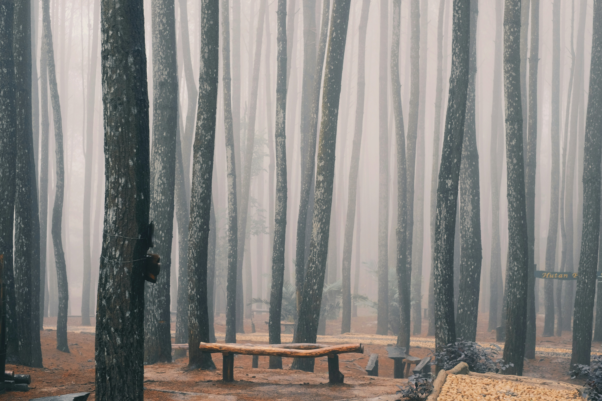
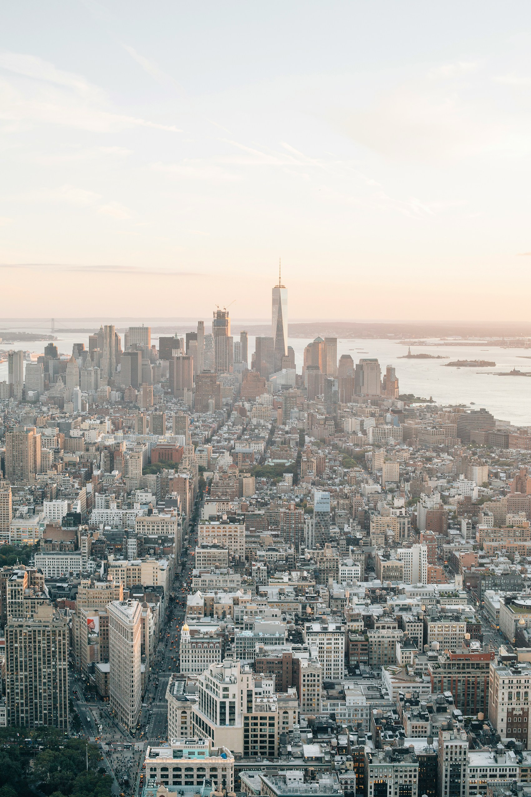
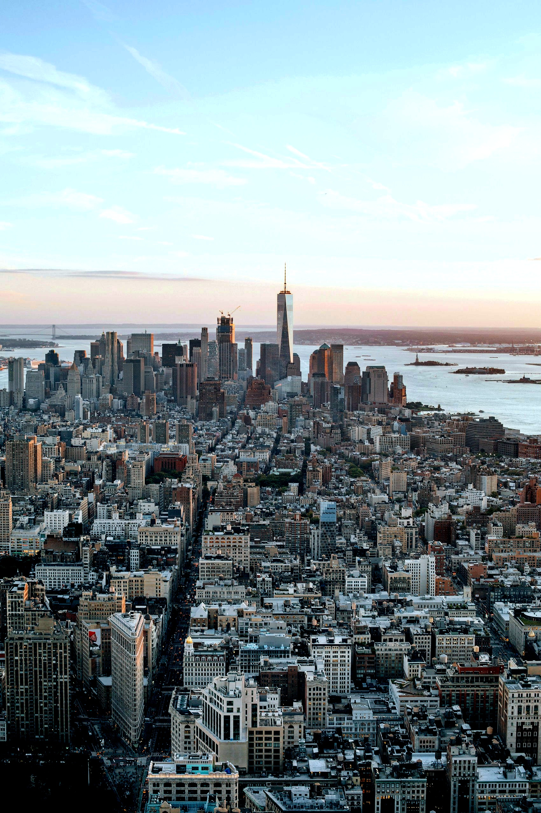

# Haze Removal Project

## 🌍 Introduction

This project implements haze removal techniques based on **Dark Channel Prior** and **Color Attenuation Prior**, using **Guided Filtering** or **Weighted Guided Filtering**.
The goal is to restore contrast and detail, making hazy images clearer and more visually accurate.

The project is designed to be flexible and easily extendable, using **Object-Oriented Programming (OOP)** principles.

---

## 🖼️ Example Outputs

<h4 align="center">Original Image vs Processed Image Using Dark Channel Prior with Weighted Guided Filtering</h4>

 

<h4 align="center">Original Image vs Processed Image Using Color Attenuation Prior with Guided Filtering</h4>

 

<h4 align="center">Original Image vs Processed Image Using Color Attenuation Prior with Weighted Guided Filtering</h4>

 

---
## ✨ Features
- This project supports **four** haze removal techniques:
  - **Dark Channel Prior** using **Guided Filtering**
  - **Dark Channel Prior** using **Weighted Guided Filtering**
  - **Color Attenuation Prior** using **Guided Filtering**
  - **Color Attenuation Prior** using **Weighted Guided Filtering**
- **Interactive Command-Line Interface** — Dynamically select the image path and haze removal technique.  

---

## 🔧 Installation

### Requirements

Ensure you have **Python 3.10** or newer installed, then clone the repository and install the dependencies:

```bash
# Clone the repository
git clone https://github.com/Lion-sudo/Haze-Removal.git

# Change the directory 
cd Haze-Removal

# Install dependencies
pip install -r requirements.txt
```

The required libraries are:

- `opencv-python~=4.11.0.86`
- `numpy~=2.2.2`

---

## ⚡ Usage

Run the program with:

```bash
python haze_removal.py
```

### Step 1: Provide an image path

Once the program starts, you'll be prompted to enter the **path to the image** you wish to process:

```bash
Please provide the path to the image you would like to use:
```

### Step 2: Choose a haze removal technique

After loading the image, select a haze removal method from the list:

```yaml
Choose the haze removal method:
1: Dark Channel Prior using Guided Filter 
2: Dark Channel Prior using Weighted Guided Filter 
3: Color Attenuation Prior using Guided Filter
4: Color Attenuation Prior using Weighted Guided Filter
5: Exit the program
```

### Step 3: Continue or exit

After processing, you'll be asked whether you want to continue or exit the program:

```yaml
Would you like to continue or exit?
1: Continue using the current image
2: Load a new image
3: Exit the program
```

- If you choose **1**, you'll go back to Step 2 using the same image.
- If you choose **2**, you'll return to Step 1 to provide a new image path.
- If you choose **3**, the program will exit.

The program keeps running until you choose to exit.

### Output Image Naming Convention

The processed images will be saved in the project directory using the following naming format:  
`{input_name}_haze_free_{method_name}.jpg`

- `{input_name}` refers to the name of the input image chosen by the user.
- `{method_name}` indicates the haze removal technique chosen by the user.

For example:
- `new_york3_haze_free_CAP_Guided_Method.jpg` is the output of the image selected by the user ("new_york3.jpg"), processed using **Color Attenuation Prior** with **Guided Filtering**.

You can continue experimenting with different techniques or process multiple images before exiting.

---

## 📁 Project Structure

- **`haze_removal.py`** — Main script for running the program.  
- **`removers_factory.py`** — Factory for creating haze remover instances.  
- **hazeRemovers/** — Folder containing all haze remover classes:  
  - `DCP_remover.py`  (Dark Channel Prior)
  - `CAP_remover.py`  (Color Attenuation Prior)
  - `abstract_haze_remover.py` (abstract base class)
- **`filters.py`** — A file containing the implementations of Guided and Weighted Guided Filtering.
- **`requirements.txt`** — Lists the dependencies.  

---

## 🧑‍💻 Author

**Lion Abramov**  
GitHub: [Lion-sudo](https://github.com/Lion-sudo)  

---

## 🏛️ Citations

This project is based on the following papers:
- K. He, J. Sun and X. Tang, **["Single Image Haze Removal Using Dark Channel Prior"](https://ieeexplore.ieee.org/abstract/document/5567108)**, IEEE Transactions on Pattern Analysis and Machine Intelligence, vol. 33, no. 12, pp. 2341-2353, Dec. 2011.
- Q. Zhu, J. Mai and L. Shao, **["A Fast Single Image Haze Removal Algorithm Using Color Attenuation Prior"](https://ieeexplore.ieee.org/abstract/document/7128396)**, IEEE Transactions on Image Processing, vol. 24, no. 11, pp. 3522-3533, Nov. 2015.
- K. He, J. Sun and X. Tang, **["Guided Image Filtering"](https://ieeexplore.ieee.org/abstract/document/6319316)**, IEEE Transactions on Pattern Analysis and Machine Intelligence, vol. 35, no. 6, pp. 1397-1409, June 2013.
- Z. Li, J. Zheng, Z. Zhu, W. Yao and S. Wu, **["Weighted Guided Image Filtering"](https://ieeexplore.ieee.org/abstract/document/6957555)**, IEEE Transactions on Image Processing, vol. 24, no. 1, pp. 120-129, Jan. 2015.

---

## 📜 License

This project is licensed under the **MIT License** — see the [LICENSE](LICENSE) file for details.  
